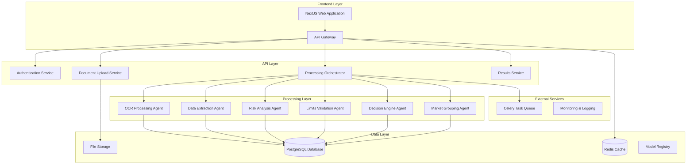

# Design Document

## Overview

The AI-Powered Facultative Reinsurance Decision Support System is designed as a microservices-based architecture that processes various document types, extracts and analyzes risk data, and provides intelligent decision support for underwriters. The system leverages open-source AI models, modern web technologies, and distributed processing to deliver a scalable, efficient solution.

## Architecture

### High-Level Architecture



### Technology Stack

**Backend:**
- **Framework:** FastAPI (Python)
- **Task Queue:** Celery with Redis broker
- **Database:** PostgreSQL for structured data
- **Cache:** Redis for session management and caching
- **File Storage:** Local filesystem or S3-compatible storage
- **OCR:** DOCTR (open-source)
- **ML Models:** Hugging Face Transformers, scikit-learn, PyTorch

**Recommended Hugging Face Models:**
- **NER (Named Entity Recognition):** `dbmdz/bert-large-cased-finetuned-conll03-english` or `microsoft/DialoGPT-medium`
- **Financial Entity Extraction:** `ProsusAI/finbert` or `nlpaueb/legal-bert-base-uncased`
- **Text Classification:** `distilbert-base-uncased-finetuned-sst-2-english` for sentiment, `facebook/bart-large-mnli` for zero-shot classification
- **Document Understanding:** `microsoft/layoutlm-base-uncased` or `microsoft/layoutlmv3-base`
- **Risk Assessment:** `ProsusAI/finbert` for financial risk analysis
- **Geographic Entity Recognition:** `dbmdz/bert-large-cased-finetuned-conll03-english` with custom fine-tuning
- **Industry Classification:** `facebook/bart-large-mnli` for zero-shot industry classification
- **Embeddings:** `sentence-transformers/all-MiniLM-L6-v2` for document similarity and clustering

**Frontend:**
- **Framework:** NextJS 14 with TypeScript
- **Styling:** Tailwind CSS
- **UI Components:** Shadcn/ui
- **State Management:** Zustand or React Query
- **Charts:** Recharts or Chart.js

**Infrastructure:**
- **Containerization:** Docker
- **Orchestration:** Docker Compose (development) / Kubernetes (production)
- **Monitoring:** Prometheus + Grafana
- **Logging:** ELK Stack (Elasticsearch, Logstash, Kibana)

## Components and Interfaces

### 1. Document Upload Service

**Purpose:** Handle file uploads and initial document validation

**Key Features:**
- Multi-format support (PDF, images, .msg files, Excel)
- File validation and virus scanning
- Metadata extraction
- Storage management

**API Endpoints:**
```python
POST /api/v1/documents/upload
GET /api/v1/documents/{document_id}
DELETE /api/v1/documents/{document_id}
GET /api/v1/documents/{document_id}/status
```

**Interface:**
```python
class DocumentUploadService:
    def upload_document(self, file: UploadFile, metadata: dict) -> DocumentResponse
    def validate_document(self, file: UploadFile) -> ValidationResult
    def store_document(self, file: UploadFile, document_id: str) -> StorageResult
    def get_document_metadata(self, document_id: str) -> DocumentMetadata
```

### 2. OCR Processing Agent

**Purpose:** Extract text and structured data from various document formats

**Key Features:**
- DOCTR integration for image-based documents
- PDF text extraction
- Email parsing (.msg files)
- Excel sheet processing

**Interface:**
```python
class OCRProcessingAgent:
    def process_pdf(self, file_path: str) -> OCRResult
    def process_scanned_pdf(self, file_path: str) -> OCRResult
    def process_email(self, file_path: str) -> EmailContent
    def process_excel(self, file_path: str) -> ExcelData
    def extract_text_regions(self, image: np.ndarray) -> List[TextRegion]
```

### 3. Data Extraction Agent

**Purpose:** Extract and structure risk-related information from processed documents

**Key Features:**
- Named Entity Recognition (NER) for risk parameters
- Pattern matching for financial data
- Geographic location extraction
- Asset classification

**Hugging Face Models Used:**
- **NER Model:** `dbmdz/bert-large-cased-finetuned-conll03-english` for general entity extraction
- **Financial NER:** `ProsusAI/finbert` for financial entity recognition
- **Document Layout:** `microsoft/layoutlmv3-base` for structured document understanding
- **Zero-shot Classification:** `facebook/bart-large-mnli` for asset type classification

**Interface:**
```python
class DataExtractionAgent:
    def __init__(self):
        self.ner_model = AutoTokenizer.from_pretrained("dbmdz/bert-large-cased-finetuned-conll03-english")
        self.financial_model = AutoModel.from_pretrained("ProsusAI/finbert")
        self.layout_model = AutoModel.from_pretrained("microsoft/layoutlmv3-base")
        self.classifier = pipeline("zero-shot-classification", model="facebook/bart-large-mnli")
    
    def extract_risk_parameters(self, text: str) -> RiskParameters
    def extract_financial_data(self, text: str) -> FinancialData
    def extract_geographic_info(self, text: str) -> GeographicData
    def classify_asset_type(self, description: str) -> AssetType
    def validate_extracted_data(self, data: dict) -> ValidationResult
```

### 4. Risk Analysis Agent

**Purpose:** Analyze risk factors and generate risk assessments

**Key Features:**
- Historical loss analysis
- Catastrophe exposure modeling
- Financial strength assessment
- Risk scoring algorithms

**Hugging Face Models Used:**
- **Financial Analysis:** `ProsusAI/finbert` for financial sentiment and risk assessment
- **Text Embeddings:** `sentence-transformers/all-MiniLM-L6-v2` for similarity analysis of risk descriptions
- **Regression Models:** Custom fine-tuned models based on `distilbert-base-uncased` for risk scoring
- **Time Series Analysis:** `huggingface/CodeBERTa-small-v1` adapted for loss pattern analysis

**Interface:**
```python
class RiskAnalysisAgent:
    def __init__(self):
        self.finbert = AutoModel.from_pretrained("ProsusAI/finbert")
        self.embeddings = SentenceTransformer('sentence-transformers/all-MiniLM-L6-v2')
        self.risk_classifier = pipeline("text-classification", model="ProsusAI/finbert")
    
    def analyze_loss_history(self, loss_data: List[LossEvent]) -> LossAnalysis
    def assess_catastrophe_exposure(self, location: Location, asset_type: str) -> CatExposure
    def evaluate_financial_strength(self, financials: FinancialData) -> FinancialRating
    def calculate_risk_score(self, risk_factors: RiskFactors) -> RiskScore
    def generate_risk_report(self, analysis_results: dict) -> RiskReport
```

### 5. Limits Validation Agent

**Purpose:** Validate applications against business limits and constraints

**Key Features:**
- Business limit checking
- Regulatory compliance validation
- Geographic exposure limits
- Industry sector restrictions

**Interface:**
```python
class LimitsValidationAgent:
    def check_business_limits(self, application: Application) -> LimitCheckResult
    def validate_geographic_limits(self, location: Location, amount: float) -> ValidationResult
    def check_sector_restrictions(self, industry: str, asset_type: str) -> RestrictionResult
    def validate_regulatory_compliance(self, application: Application) -> ComplianceResult
```

### 6. Decision Engine Agent

**Purpose:** Generate intelligent recommendations based on analysis results

**Key Features:**
- Multi-factor decision algorithms
- Confidence scoring
- Recommendation rationale generation
- Conditional approval terms

**Hugging Face Models Used:**
- **Decision Classification:** `microsoft/DialoGPT-medium` fine-tuned for decision reasoning
- **Text Generation:** `facebook/bart-base` for generating rationale explanations
- **Ensemble Models:** Combination of `distilbert-base-uncased` and `ProsusAI/finbert` for multi-factor analysis
- **Confidence Estimation:** `microsoft/deberta-v3-base` for uncertainty quantification

**Interface:**
```python
class DecisionEngineAgent:
    def __init__(self):
        self.decision_model = AutoModel.from_pretrained("microsoft/DialoGPT-medium")
        self.rationale_generator = pipeline("text2text-generation", model="facebook/bart-base")
        self.confidence_model = AutoModel.from_pretrained("microsoft/deberta-v3-base")
    
    def generate_recommendation(self, analysis_data: AnalysisData) -> Recommendation
    def calculate_confidence_score(self, factors: List[Factor]) -> float
    def generate_rationale(self, decision: Decision, factors: List[Factor]) -> str
    def suggest_terms_conditions(self, risk_profile: RiskProfile) -> List[Condition]
```

### 7. Market Grouping Agent

**Purpose:** Classify and group documents by market segments

**Key Features:**
- Market identification from content
- Geographic market classification
- Industry sector grouping
- Relationship mapping

**Hugging Face Models Used:**
- **Geographic Classification:** `facebook/bart-large-mnli` for zero-shot geographic classification
- **Industry Classification:** `microsoft/DialoGPT-medium` fine-tuned for industry sector identification
- **Document Clustering:** `sentence-transformers/all-MiniLM-L6-v2` for document similarity and grouping
- **Relationship Extraction:** `dbmdz/bert-large-cased-finetuned-conll03-english` for entity relationship mapping

**Interface:**
```python
class MarketGroupingAgent:
    def __init__(self):
        self.geo_classifier = pipeline("zero-shot-classification", model="facebook/bart-large-mnli")
        self.industry_model = AutoModel.from_pretrained("microsoft/DialoGPT-medium")
        self.embeddings = SentenceTransformer('sentence-transformers/all-MiniLM-L6-v2')
        self.ner_model = pipeline("ner", model="dbmdz/bert-large-cased-finetuned-conll03-english")
    
    def identify_market(self, content: str, metadata: dict) -> Market
    def classify_geographic_market(self, location: Location) -> GeographicMarket
    def group_by_industry(self, documents: List[Document]) -> Dict[str, List[Document]]
    def map_relationships(self, documents: List[Document]) -> RelationshipMap
```

## Data Models

### Core Data Models

```python
from pydantic import BaseModel
from typing import List, Optional, Dict, Any
from datetime import datetime
from enum import Enum

class DocumentType(str, Enum):
    PDF = "pdf"
    SCANNED_PDF = "scanned_pdf"
    EMAIL = "email"
    EXCEL = "excel"

class Document(BaseModel):
    id: str
    filename: str
    document_type: DocumentType
    file_path: str
    upload_timestamp: datetime
    processed: bool = False
    metadata: Dict[str, Any] = {}

class RiskParameters(BaseModel):
    asset_value: Optional[float]
    coverage_limit: Optional[float]
    asset_type: Optional[str]
    location: Optional[str]
    industry_sector: Optional[str]
    construction_type: Optional[str]
    occupancy: Optional[str]

class FinancialData(BaseModel):
    revenue: Optional[float]
    assets: Optional[float]
    liabilities: Optional[float]
    credit_rating: Optional[str]
    financial_strength_rating: Optional[str]

class LossEvent(BaseModel):
    date: datetime
    amount: float
    cause: str
    description: str

class RiskScore(BaseModel):
    overall_score: float
    confidence: float
    factors: Dict[str, float]
    risk_level: str  # LOW, MEDIUM, HIGH, CRITICAL

class Recommendation(BaseModel):
    decision: str  # APPROVE, REJECT, CONDITIONAL
    confidence: float
    rationale: str
    conditions: List[str] = []
    premium_adjustment: Optional[float]
    coverage_modifications: List[str] = []

class Application(BaseModel):
    id: str
    documents: List[Document]
    risk_parameters: RiskParameters
    financial_data: FinancialData
    loss_history: List[LossEvent]
    risk_analysis: Optional[Dict[str, Any]]
    recommendation: Optional[Recommendation]
    status: str
    created_at: datetime
    updated_at: datetime
```

### Database Schema

```sql
-- Applications table
CREATE TABLE applications (
    id UUID PRIMARY KEY DEFAULT gen_random_uuid(),
    status VARCHAR(50) NOT NULL DEFAULT 'pending',
    created_at TIMESTAMP WITH TIME ZONE DEFAULT NOW(),
    updated_at TIMESTAMP WITH TIME ZONE DEFAULT NOW()
);

-- Documents table
CREATE TABLE documents (
    id UUID PRIMARY KEY DEFAULT gen_random_uuid(),
    application_id UUID REFERENCES applications(id),
    filename VARCHAR(255) NOT NULL,
    document_type VARCHAR(50) NOT NULL,
    file_path TEXT NOT NULL,
    processed BOOLEAN DEFAULT FALSE,
    metadata JSONB,
    upload_timestamp TIMESTAMP WITH TIME ZONE DEFAULT NOW()
);

-- Risk parameters table
CREATE TABLE risk_parameters (
    id UUID PRIMARY KEY DEFAULT gen_random_uuid(),
    application_id UUID REFERENCES applications(id),
    asset_value DECIMAL(15,2),
    coverage_limit DECIMAL(15,2),
    asset_type VARCHAR(100),
    location TEXT,
    industry_sector VARCHAR(100),
    construction_type VARCHAR(100),
    occupancy VARCHAR(100)
);

-- Financial data table
CREATE TABLE financial_data (
    id UUID PRIMARY KEY DEFAULT gen_random_uuid(),
    application_id UUID REFERENCES applications(id),
    revenue DECIMAL(15,2),
    assets DECIMAL(15,2),
    liabilities DECIMAL(15,2),
    credit_rating VARCHAR(10),
    financial_strength_rating VARCHAR(10)
);

-- Loss events table
CREATE TABLE loss_events (
    id UUID PRIMARY KEY DEFAULT gen_random_uuid(),
    application_id UUID REFERENCES applications(id),
    event_date DATE NOT NULL,
    amount DECIMAL(15,2) NOT NULL,
    cause VARCHAR(255),
    description TEXT
);

-- Risk analysis table
CREATE TABLE risk_analysis (
    id UUID PRIMARY KEY DEFAULT gen_random_uuid(),
    application_id UUID REFERENCES applications(id),
    overall_score DECIMAL(5,2),
    confidence DECIMAL(5,2),
    risk_level VARCHAR(20),
    factors JSONB,
    analysis_data JSONB,
    created_at TIMESTAMP WITH TIME ZONE DEFAULT NOW()
);

-- Recommendations table
CREATE TABLE recommendations (
    id UUID PRIMARY KEY DEFAULT gen_random_uuid(),
    application_id UUID REFERENCES applications(id),
    decision VARCHAR(20) NOT NULL,
    confidence DECIMAL(5,2),
    rationale TEXT,
    conditions JSONB,
    premium_adjustment DECIMAL(5,2),
    coverage_modifications JSONB,
    created_at TIMESTAMP WITH TIME ZONE DEFAULT NOW()
);

-- Business limits table
CREATE TABLE business_limits (
    id UUID PRIMARY KEY DEFAULT gen_random_uuid(),
    limit_type VARCHAR(100) NOT NULL,
    category VARCHAR(100),
    max_amount DECIMAL(15,2),
    geographic_region VARCHAR(100),
    industry_sector VARCHAR(100),
    active BOOLEAN DEFAULT TRUE,
    created_at TIMESTAMP WITH TIME ZONE DEFAULT NOW()
);
```

## Error Handling

### Error Categories

1. **Document Processing Errors**
   - Invalid file format
   - Corrupted files
   - OCR processing failures
   - File size limitations

2. **Data Extraction Errors**
   - Incomplete data extraction
   - Data validation failures
   - Format inconsistencies
   - Missing required fields

3. **Analysis Errors**
   - Model inference failures
   - Insufficient data for analysis
   - Calculation errors
   - External service unavailability

4. **Business Logic Errors**
   - Limit violations
   - Regulatory compliance failures
   - Invalid business rules
   - Workflow state errors

### Error Handling Strategy

```python
class ErrorHandler:
    def handle_document_error(self, error: DocumentError) -> ErrorResponse:
        # Log error, notify user, attempt recovery
        pass
    
    def handle_processing_error(self, error: ProcessingError) -> ErrorResponse:
        # Retry logic, fallback processing, error reporting
        pass
    
    def handle_business_error(self, error: BusinessError) -> ErrorResponse:
        # Business rule validation, user notification
        pass
```

### Retry and Recovery Mechanisms

- **Exponential backoff** for transient failures
- **Circuit breaker pattern** for external service calls
- **Dead letter queues** for failed tasks
- **Graceful degradation** when services are unavailable

## Testing Strategy

### Unit Testing
- Individual agent testing with mock data
- Data model validation testing
- Business logic testing
- API endpoint testing

### Integration Testing
- End-to-end document processing workflows
- Multi-agent coordination testing
- Database integration testing
- External service integration testing

### Performance Testing
- Load testing for concurrent document processing
- Stress testing for high-volume scenarios
- Memory and CPU usage optimization
- Response time benchmarking

### Security Testing
- Authentication and authorization testing
- Input validation and sanitization
- File upload security testing
- API security testing

### Test Data Management
- Synthetic test document generation
- Anonymized production data samples
- Edge case scenario testing
- Regression test suites

## Model Management and Deployment

### Hugging Face Model Registry

**Model Storage and Versioning:**
```python
class ModelRegistry:
    def __init__(self):
        self.models = {
            "ner": "dbmdz/bert-large-cased-finetuned-conll03-english",
            "financial_ner": "ProsusAI/finbert",
            "layout_analysis": "microsoft/layoutlmv3-base",
            "zero_shot_classifier": "facebook/bart-large-mnli",
            "embeddings": "sentence-transformers/all-MiniLM-L6-v2",
            "decision_generator": "microsoft/DialoGPT-medium",
            "rationale_generator": "facebook/bart-base",
            "confidence_estimator": "microsoft/deberta-v3-base"
        }
    
    def load_model(self, model_name: str):
        return AutoModel.from_pretrained(self.models[model_name])
    
    def update_model(self, model_name: str, new_version: str):
        # Model versioning and hot-swapping logic
        pass
```

**Model Performance Monitoring:**
- Track inference latency and accuracy metrics
- A/B testing for model updates
- Automated model retraining pipelines
- Model drift detection

**Resource Optimization:**
- Model quantization for faster inference
- GPU/CPU allocation strategies
- Batch processing for efficiency
- Model caching and warm-up procedures

### Fine-tuning Strategy

**Domain-Specific Fine-tuning:**
1. **Financial Entity Recognition:** Fine-tune `ProsusAI/finbert` on reinsurance-specific documents
2. **Risk Classification:** Adapt `distilbert-base-uncased` for reinsurance risk categories
3. **Decision Reasoning:** Fine-tune `microsoft/DialoGPT-medium` on historical underwriting decisions
4. **Industry Classification:** Customize `facebook/bart-large-mnli` for reinsurance industry sectors

**Training Data Requirements:**
- Anonymized historical reinsurance applications
- Synthetic data generation for edge cases
- Expert-labeled training datasets
- Continuous learning from user feedback

## Deployment Architecture

### Development Environment
```yaml
version: '3.8'
services:
  web:
    build: ./backend
    ports:
      - "8000:8000"
    environment:
      - DATABASE_URL=postgresql://user:pass@db:5432/reinsurance
      - REDIS_URL=redis://redis:6379
    depends_on:
      - db
      - redis
  
  frontend:
    build: ./frontend
    ports:
      - "3000:3000"
    environment:
      - NEXT_PUBLIC_API_URL=http://localhost:8000
  
  db:
    image: postgres:15
    environment:
      - POSTGRES_DB=reinsurance
      - POSTGRES_USER=user
      - POSTGRES_PASSWORD=pass
    volumes:
      - postgres_data:/var/lib/postgresql/data
  
  redis:
    image: redis:7-alpine
    ports:
      - "6379:6379"
  
  celery:
    build: ./backend
    command: celery -A app.celery worker --loglevel=info
    depends_on:
      - redis
      - db
```

### Production Considerations
- **Horizontal scaling** with load balancers
- **Database clustering** for high availability
- **CDN integration** for static assets
- **SSL/TLS termination** at load balancer
- **Monitoring and alerting** with Prometheus/Grafana
- **Log aggregation** with ELK stack
- **Backup and disaster recovery** procedures